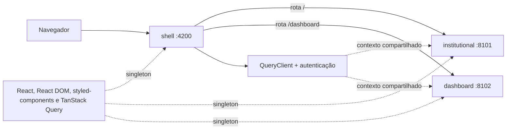
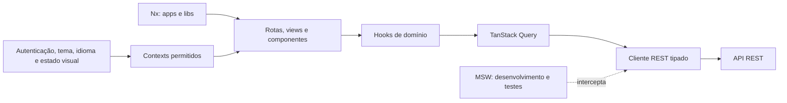

# Arquitetura do Tech Challenge

## Status

Este documento define a arquitetura alvo atualizada em 24 de julho de 2026. O fluxo de transações e a Home analítica seguem a arquitetura REST mockada com MSW e TanStack Query, sem dados remotos em Context. A landing page está no remote `institutional`; o dashboard e suas rotas estão no remote `dashboard`; o shell concentra a composição, o QueryClient e a autenticação.

## Decisões definitivas

- React 18 e Next.js 14 com App Router.
- Radix UI para primitivas acessíveis e `styled-components` para estilos.
- Jest e React Testing Library para testes.
- Context API somente para autenticação, tema, idioma e estado visual.
- TanStack Query para todo estado de servidor.
- Contratos REST simulados por MSW em desenvolvimento e testes.
- Sem Angular, Redux, Recoil ou GraphQL.
- Workspace Nx exclusivamente React/Next.js.
- Module Federation exclusivamente entre aplicações React standalone.
- `shell` como host/consumer, `institutional` e `dashboard` como remotes/providers.
- React, React DOM, styled-components e TanStack Query compartilhados como singletons.
- Um único `QueryClient` e uma única origem de autenticação no shell federado.

## Composição federada



O shell registra as URLs dos remotes em runtime e carrega somente o remote correspondente à rota atual. Cada carregamento possui estado acessível de progresso e fallback isolado com nova tentativa. A indisponibilidade de um remote não desmonta o shell nem impede o carregamento do outro.

As URLs padrão atendem o desenvolvimento local e podem ser substituídas no build/deploy:

| Variável | Padrão local |
| --- | --- |
| `INSTITUTIONAL_REMOTE_URL` | `http://127.0.0.1:8101/remoteEntry.js` |
| `DASHBOARD_REMOTE_URL` | `http://127.0.0.1:8102/remoteEntry.js` |

Cada aplicação possui targets próprios `serve`, `build`, `lint`, `typecheck` e `test`. Os builds dos remotes publicam `remoteEntry.js` e tipos federados sem depender do build do shell.

## Visão geral



A UI renderiza os estados fornecidos pelos hooks de domínio. Esses hooks encapsulam queries e mutations, enquanto o cliente REST concentra URL, método, serialização e tratamento de erro. Em desenvolvimento e teste, o MSW intercepta a mesma interface HTTP que será atendida por uma API real.

## Limites de responsabilidade

| Camada | Responsabilidade | Não deve fazer |
| --- | --- | --- |
| `apps/banking/src/app` | Rotas, layouts, providers e boundaries do App Router | Armazenar dados remotos em estado local |
| `apps/shell` | Composição, roteamento dos remotes e providers globais federados | Implementar domínio de dashboard ou duplicar providers nos remotes |
| `apps/institutional` | Landing page e login federados, também executáveis standalone | Criar autenticação ou `QueryClient` próprios para a composição |
| `apps/dashboard` | Dashboard autenticado, rotas internas e análises financeiras | Duplicar autenticação, QueryClient ou cálculos de domínio na interface |
| `apps/banking/src/views` | Composição de páginas e estados de apresentação | Acessar fixtures ou implementar contratos HTTP |
| `apps/banking/src/components` | Composição de UI específica da aplicação | Conhecer MSW ou implementar contratos HTTP |
| hooks de domínio | Expor queries e mutations com uma API de uso previsível | Duplicar cache em Context |
| `libs/shared/ui` | Primitivas Radix UI, estilos e componentes reutilizáveis | Acessar data-access, auth ou testing |
| `libs/shared/types` | Tipos neutros de transação, categoria, filtros, ordenação e políticas de anexos | Depender de APIs de plataforma |
| `libs/shared/domain` | Moeda em centavos, datas, mapeamentos e agregações puras | Conhecer persistência, DOM ou UI |
| `libs/shared/validation` | Schemas Zod independentes de plataforma | Validar objetos específicos de web ou mobile |
| `libs/shared/design-tokens` | Cores, espaçamento, raios e tipografia primitivos | Expor CSS, `className` ou componentes |
| `libs/shared/api-client` | Executar requests e traduzir erros de transporte | Controlar estado visual |
| `libs/shared/query` | Configuração comum do TanStack Query | Conhecer views ou mocks |
| `libs/shared/auth` | Context e contrato de autenticação global | Armazenar outros dados de servidor |
| `libs/shared/testing` | MSW, fixtures e setup de testes | Ser importado pelo bundle de produção, exceto o bootstrap de mocks em desenvolvimento |

## Modelo de estado

| Tipo de estado | Solução |
| --- | --- |
| Sessão e identidade usadas globalmente | Context de autenticação |
| Tema | Context de tema |
| Idioma e locale | Context de idioma |
| Sidebar, modal, tooltip e toast | Estado local ou Context visual próximo do consumidor |
| Transações, saldos, resumos, extratos e perfil remoto | TanStack Query |
| Loading, erro, retry e invalidação de recursos remotos | TanStack Query |
| Estado transitório de formulário | React Hook Form |

Não deve existir espelhamento de uma query em `useState`, `useReducer` ou Context. Estado derivado do servidor deve vir no contrato ou ser selecionado no hook da query apenas quando for uma transformação estritamente de apresentação.

## API REST mockada

O primeiro domínio migrado é transações. O contrato implementado inclui:

| Método e endpoint | Finalidade |
| --- | --- |
| `GET /api/transactions` | Lista de transações pronta para exibição |
| `POST /api/transactions` | Criação de uma transação |
| `PUT /api/transactions/:id` | Atualização integral de uma transação |
| `DELETE /api/transactions/:id` | Exclusão de uma transação |
| `GET /api/dashboard/summary` | Saldo, entradas e saídas agregados |
| `GET /api/dashboard/monthly` | Série mensal pronta para os gráficos |
| `GET /api/dashboard/home` | Indicadores, comparações, fluxo, categorias e transações recentes prontos para apresentação |

Os handlers do MSW devem:

- reutilizar os tipos dos contratos REST;
- responder com status HTTP coerentes, incluindo erros;
- manter fixtures fora dos componentes;
- ser usados por `setupServer` no Jest e por `setupWorker` somente em desenvolvimento;
- falhar em requests não tratados nos testes para evitar falsos positivos.

## Estrutura do workspace Nx

```text
apps/
|-- banking/                     # aplicação Next.js atual
|-- shell/                       # host React da federação
|-- institutional/               # remote React institucional
`-- dashboard/                   # remote React do dashboard
libs/
`-- shared/
    |-- ui/                      # Radix UI e styled-components
    |-- types/                   # tipos e políticas neutros
    |-- domain/                  # regras e transformações puras
    |-- validation/              # schemas Zod neutros
    |-- design-tokens/           # tokens visuais primitivos
    |-- api-client/              # cliente HTTP tipado
    |-- query/                   # configuração TanStack Query
    |-- auth/                    # autenticação global
    `-- testing/                 # MSW, fixtures e setup Jest
```

Cada projeto possui `project.json`, tags de camada e targets de qualidade. Os aliases canônicos usam o prefixo `@banking/shared/*`. O alias `@/*` continua reservado ao código interno de `apps/banking/src`.

O ESLint aplica `@nx/enforce-module-boundaries`: `types` permanece isolada; `ui` acessa apenas UI e tipos; data-access acessa apenas data-access e tipos; auth pode compor UI, tipos e data-access; testing pode compor as bibliotecas compartilhadas. A aplicação pode consumir as libs compartilhadas.

O Module Federation conecta somente `shell`, `institutional` e `dashboard`. O app Next.js `banking` não participa do share scope e permanece disponível durante a migração incremental. Angular continua fora da arquitetura.

## Fluxo de consulta e mutação

1. A view chama um hook de domínio.
2. O hook usa uma query key centralizada e o cliente REST.
3. O MSW atende a chamada em desenvolvimento ou teste; em produção, a API real assume o mesmo contrato.
4. A query mantém cache, loading, erro e retry.
5. Uma mutation invalida ou atualiza somente as query keys afetadas.
6. A UI recebe dados prontos e mantém localmente apenas interação visual e formulário.

## Migração realizada

1. MSW configurado para navegador e Jest.
2. Contratos REST em `libs/shared/types` e cliente em `libs/shared/api-client`.
3. Fixtures, handlers MSW e setup Jest em `libs/shared/testing`.
4. Primitivas Radix UI e estilos compartilhados em `libs/shared/ui`.
5. Query client comum em `libs/shared/query` e autenticação em `libs/shared/auth`.
6. Query keys, queries e mutations centralizadas por domínio no app.
7. Views consumindo estados de loading, erro, vazio e sucesso pelos hooks.
8. `TransactionsContext` e dados locais de transações removidos.
9. Resumos, valores formatados e séries mensais entregues prontos pela API mockada.
10. Invalidação das listas e agregados coberta por testes de integração.
11. Shell e remotes React configurados com Module Federation dinâmico.
12. Singletons e providers globais centralizados no shell federado.
13. Loading, fallback acessível e retry cobertos por testes.
14. Desenvolvimento conjunto e builds independentes configurados no Nx.
15. Landing page migrada para `institutional` e dashboard completo migrado para `dashboard`.
16. Home autenticada com análises financeiras, estados de consulta e alternativas tabulares acessíveis.
17. Tipos e regras multiplataforma separados entre `types`, `domain`, `validation` e `design-tokens`, com persistência monetária em `amountInCents`.

Cada etapa deve manter lint, typecheck, testes e build verdes.
